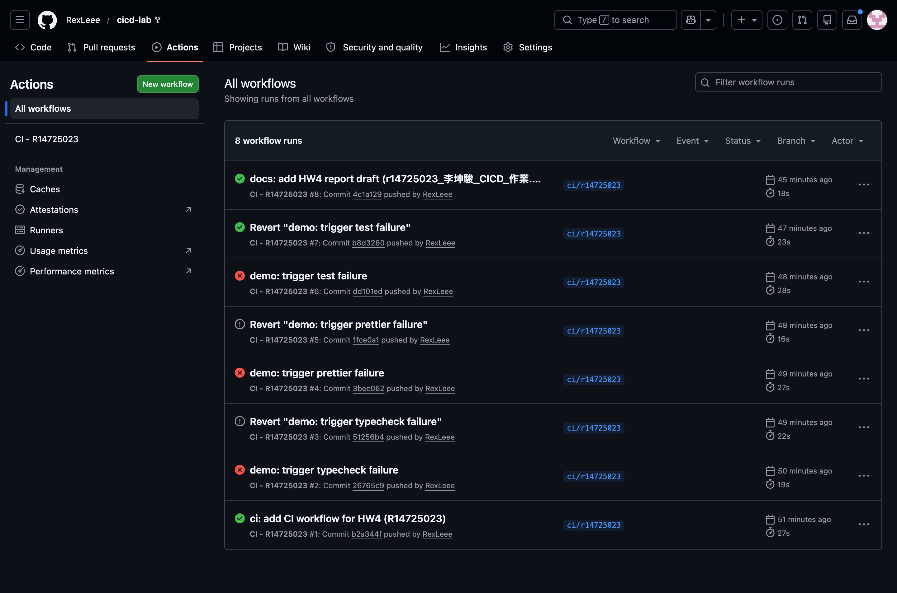
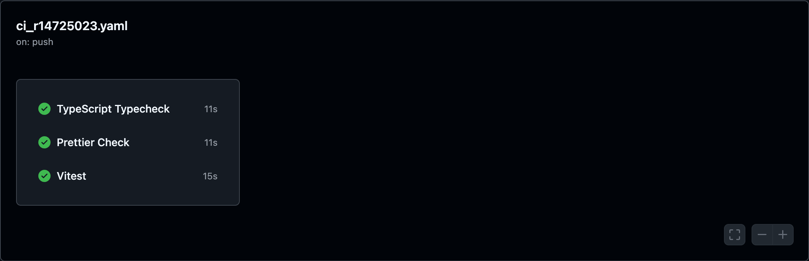
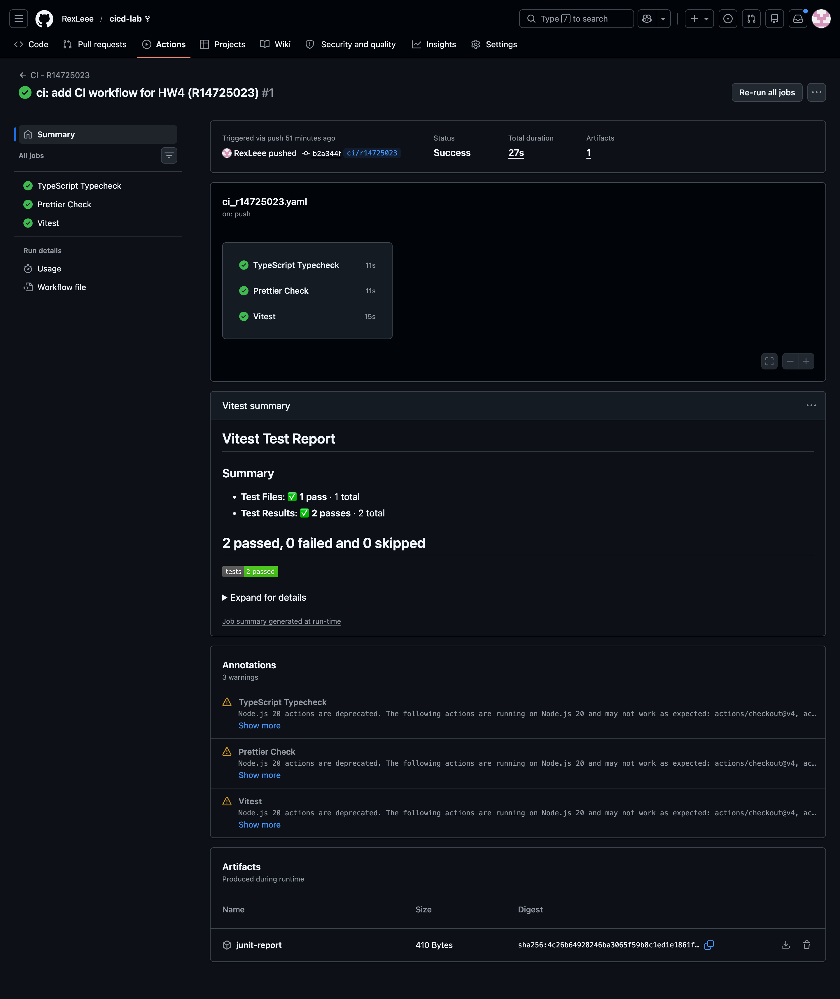
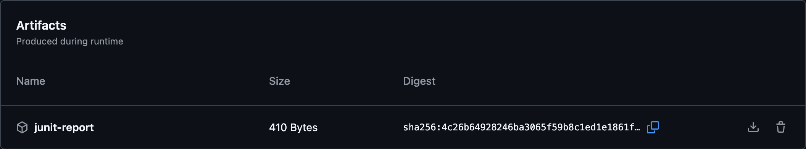
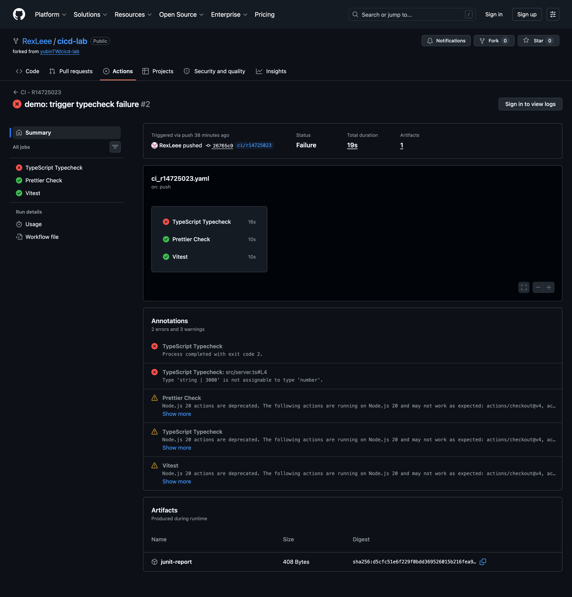
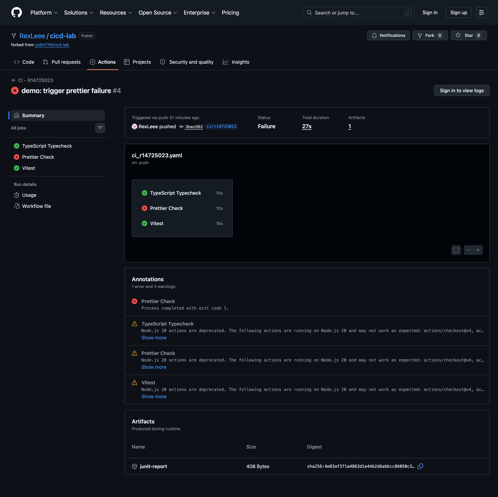
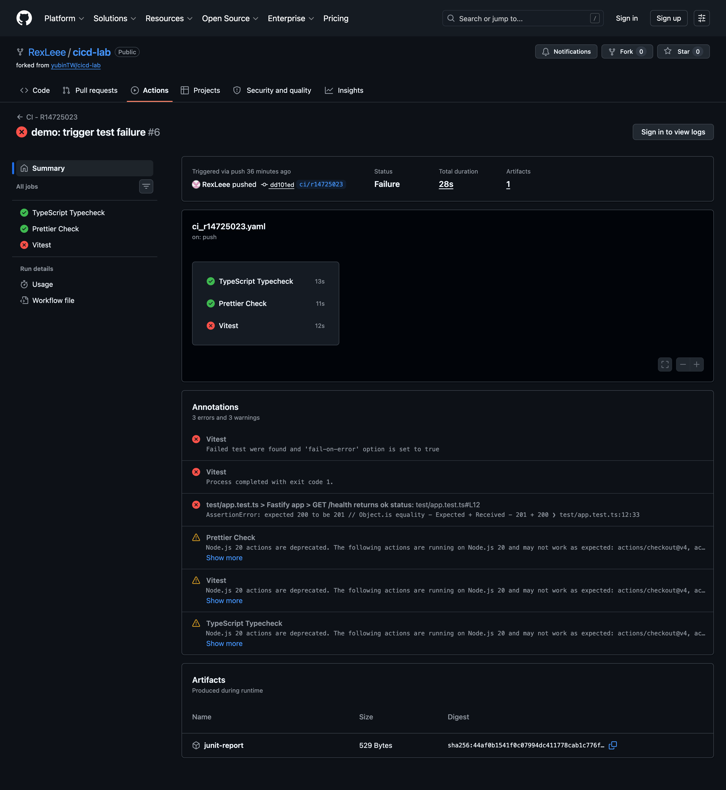

# HW4 — CI/CD Pipeline 實作報告

| 課程 | 雲原生應用程式開發 (IM5072) |
| --- | --- |
| 學號／姓名 | r14725023 / 李坤駿 |
| 作業 | HW4 — CI/CD Pipeline (15%) |
| 繳交日期 | 2026-05-07 |
| Repository | https://github.com/RexLeee/cicd-lab |
| Workflow 檔案 | `.github/workflows/ci_r14725023.yaml` |

---

## 1. 作業概述

以 [yubinTW/cicd-lab](https://github.com/yubinTW/cicd-lab) 為基礎 fork 出自己的 repo，新增 `.github/workflows/ci_r14725023.yaml` 並滿足：

- **自動觸發 (20%)** ：在 push 時自動執行
- **核心檢查 (20%)** ：TypeScript typecheck + Prettier check + Test
- **錯誤阻斷 (20%)** ：任一檢查失敗時 pipeline 顯示失敗
- **測試結果呈現 (20%)** ：將測試結果顯示在 GitHub Actions 結果頁面
- **報告說明 (20%)** ：說明實作方式、工具與策略

---

## 2. CI Pipeline 說明

### 2.1 設計策略

採取 **「三個平行 jobs」** 的架構：把 `typecheck`、`format`、`test` 拆成三個獨立的 job，平行在 GitHub Actions runner 上執行。優點：

| 項目 | 平行 jobs | 單一 job 串行 |
| --- | --- | --- |
| 失敗回饋速度 | 一次回饋三類錯誤 | 第一個失敗就停，其他不知道 |
| Actions UI 顯示 | 三個獨立 ✅/❌ 容易閱讀 | 全部塞在一個 job 內 |
| 結果阻斷 | 任一 job 紅 → workflow 紅 | 同樣達成 |
| 執行時間 | ~11–15 秒（平行） | 三步加總約 25–30 秒 |
| 報告表達力 | 清楚示範 GitHub Actions 平行化 | 較難說明設計意圖 |

考量「報告需要說明工具與策略」，三 jobs 設計能更明確展現 CI 的核心精神：**多項檢查可獨立並進，提供更快、更完整的回饋**。

### 2.2 測試結果呈現策略：三層保險

要把測試結果顯示在 GitHub Actions 結果頁面，採三層機制：

1. **`--reporter=github-actions`**：Vitest 4.x 內建 reporter，於失敗時於 PR / commit 的原始碼行旁出現 inline annotation。
2. **`--reporter=junit --outputFile.junit=reports/junit.xml`**：產出標準 JUnit XML 給 reporter / artifact 使用。
3. **[`dorny/test-reporter@v2`](https://github.com/dorny/test-reporter)**：把 JUnit XML 解析成 Markdown，寫入 GitHub Actions Step Summary（v2 預設行為），在 workflow run 詳細頁直接渲染表格化的測試結果。
4. **`actions/upload-artifact@v4`**：把整個 `reports/` 上傳成 artifact 供下載。

### 2.3 完整 yaml

```yaml
name: CI - R14725023

on:
  push:
  pull_request:

permissions:
  contents: read
  checks: write
  pull-requests: write

concurrency:
  group: ci-${{ github.workflow }}-${{ github.ref }}
  cancel-in-progress: true

jobs:
  typecheck:
    name: TypeScript Typecheck
    runs-on: ubuntu-latest
    steps:
      - name: Checkout
        uses: actions/checkout@v4

      - name: Setup Node.js
        uses: actions/setup-node@v4
        with:
          node-version: '22'
          cache: 'npm'

      - name: Install dependencies
        run: npm ci

      - name: Run TypeScript typecheck
        run: npm run typecheck

  format:
    name: Prettier Check
    runs-on: ubuntu-latest
    steps:
      - name: Checkout
        uses: actions/checkout@v4

      - name: Setup Node.js
        uses: actions/setup-node@v4
        with:
          node-version: '22'
          cache: 'npm'

      - name: Install dependencies
        run: npm ci

      - name: Run Prettier check
        run: npm run format:check

  test:
    name: Vitest
    runs-on: ubuntu-latest
    steps:
      - name: Checkout
        uses: actions/checkout@v4

      - name: Setup Node.js
        uses: actions/setup-node@v4
        with:
          node-version: '22'
          cache: 'npm'

      - name: Install dependencies
        run: npm ci

      - name: Run tests with JUnit + GitHub Actions reporter
        run: |
          mkdir -p reports
          npx vitest run \
            --reporter=default \
            --reporter=github-actions \
            --reporter=junit \
            --outputFile.junit=reports/junit.xml

      - name: Publish test report
        if: always()
        uses: dorny/test-reporter@v2
        with:
          name: Vitest Tests
          path: reports/junit.xml
          reporter: jest-junit

      - name: Upload JUnit artifact
        if: always()
        uses: actions/upload-artifact@v4
        with:
          name: junit-report
          path: reports/
          if-no-files-found: error
```

### 2.4 關鍵設計理由逐項說明

| 設定 | 為什麼這樣寫 |
| --- | --- |
| `on: [push, pull_request]` | `push` 滿足作業 20% 自動觸發要求；額外加 `pull_request` 在團隊協作 / fork 流程也適用 |
| `permissions.checks: write` | `dorny/test-reporter` 需要寫入 Check Run / Step Summary 的權限，否則 publish 會失敗 |
| `concurrency.cancel-in-progress: true` | 連續 push 時自動取消舊 run、保留最新版本，節省 CI 額度與等待時間 |
| `node-version: '22'` | 與 `package.json` 的 `"engines": ">=22 <25"` 對齊 |
| `cache: 'npm'` | 讓 `actions/setup-node@v4` 使用 `package-lock.json` hash 作為 npm cache key，第二次起 install 從 ~10s 降到 ~3s |
| `npm ci`（不用 `npm install`） | CI 環境鎖定 lockfile、不會被意外更新版本，速度更快 |
| 三 jobs 各自跑 `npm ci` | 簡單可靠；GitHub Actions cache 加持後不會明顯增加成本 |
| `if: always()` 用於 `Publish test report` & `Upload artifact` | 即使 `npx vitest run` 失敗（exit code ≠ 0）也要繼續上傳，否則失敗時看不到測試結果 |
| `reporter: jest-junit` | dorny/test-reporter v2 支援的 parser 名稱，對應 vitest 產出的 JUnit XML 格式 |

### 2.5 額外調整：`.prettierignore`

上游 repo 的 `docker-compose.yml` 與 `snippets/*.yaml` 沒有完全符合 `.prettierrc`，會讓初次 `format:check` 失敗。為了不更動上游內容、保持 fork diff 乾淨，將以下路徑加入 `.prettierignore`：

```
dist/
node_modules/
package-lock.json
docker-compose.yml
snippets/
```

決策邏輯：這些是**上游/工具產出**的設定檔，本 lab 的程式碼風格規範重點應在 `src/` 與 `test/` 我們自己寫的程式上。

---

## 3. 執行成功截圖

CI run（commit `b2a344f`）成功完成、三個 job 全綠：

| Run ID | 25478393664 |
| --- | --- |
| Branch | `ci/r14725023` |
| Commit | `b2a344f08441082e5a0de3b4dd7f6890ffea860c` |
| 三個 job | ✅ TypeScript Typecheck (11s) / ✅ Prettier Check (11s) / ✅ Vitest (15s) |

**圖 3-1**：Actions 列表頁（顯示 8 個 workflow run，含成功與三個失敗 demo）



**圖 3-2**：成功 run 詳細頁的 Workflow run graph（三個綠勾、平行 jobs 視覺化）



**圖 3-3**：dorny/test-reporter 寫入的 Vitest Test Report Step Summary —— 顯示 "2 passed, 0 failed and 0 skipped" 與 1 個 test file / 2 tests 的概況



**圖 3-4**：Artifacts 區塊 —— `junit-report` (410 Bytes) 可下載 XML



🔗 **線上參考**：https://github.com/RexLeee/cicd-lab/actions/runs/25478393664

dorny/test-reporter 寫入的 Step Summary 內容（截錄）：

```
## 2 passed, 0 failed and 0 skipped


| Report              | Passed | Failed | Skipped | Time  |
| :------------------ | -----: | -----: | ------: | ----: |
| reports/junit.xml   | 2 ✅   |        |         | 119ms |

### ✅ test/app.test.ts
  ✅ Fastify app > GET /health returns ok status
  ✅ Fastify app > GET / returns app message and version
```

---

## 4. 失敗案例說明

為驗證錯誤阻斷與三項檢查的獨立性，分別針對 typecheck / prettier / test 各製造一個失敗 commit，觀察其他 job 是否仍正常通過、整個 workflow 是否正確顯示 failed。

### 4.1 TypeScript 型別錯誤

**Commit**：[`26765c9`](https://github.com/RexLeee/cicd-lab/commit/26765c95acfd3cb821d07371bf7faf28e2189ae6) · Run [25478446729](https://github.com/RexLeee/cicd-lab/actions/runs/25478446729)

修改內容（`src/server.ts:4`）：

```diff
- const port = Number(process.env.PORT || 3000);
+ const port: number = process.env.PORT || 3000;
```

`process.env.PORT` 型別為 `string | undefined`，去掉 `Number(...)` 轉型後，`process.env.PORT || 3000` 推論為 `string | 3000`，無法指派給 `number`。

**錯誤訊息**：

```
src/server.ts(4,7): error TS2322: Type 'string | 3000' is not assignable to type 'number'.
  Type 'string' is not assignable to type 'number'.
```

**Pipeline 結果**：

| Job | 結果 |
| --- | --- |
| TypeScript Typecheck | ❌ failure (exit 2) |
| Prettier Check | ✅ success |
| Vitest | ✅ success |
| **整體 workflow** | ❌ **failed**（達成錯誤阻斷） |

**修正方式**：把 `port` 重新包回 `Number(...)`，或改成 `Number(process.env.PORT ?? 3000)`。

**圖 4-1**：Typecheck 失敗 run（Status: Failure；Typecheck ❌、其他 ✅）



### 4.2 Prettier 格式錯誤

**Commit**：[`3bec062`](https://github.com/RexLeee/cicd-lab/commit/3bec062ab98a42bd820ba06e5696df8b53acd28e) · Run [25478477048](https://github.com/RexLeee/cicd-lab/actions/runs/25478477048)

修改內容（`src/app.ts:11-12`）：

```diff
-      message: 'CI/CD Lab Fastify app is running',
-      version: process.env.APP_VERSION || 'dev'
+      message: "CI/CD Lab Fastify app is running",
+      version: process.env.APP_VERSION || "dev"
```

`.prettierrc` 設定 `"singleQuote": true`，雙引號違反規則。

**錯誤訊息**：

```
Checking formatting...
[warn] src/app.ts
[warn] Code style issues found in the above file. Run Prettier with --write to fix.
```

**Pipeline 結果**：

| Job | 結果 |
| --- | --- |
| TypeScript Typecheck | ✅ success |
| Prettier Check | ❌ failure (exit 1) |
| Vitest | ✅ success |
| **整體 workflow** | ❌ **failed** |

**修正方式**：執行 `npm run format`（即 `prettier --write .`）自動修復為單引號。

**圖 4-2**：Prettier 失敗 run（Prettier ❌、其他 ✅；annotation 顯示 exit code 1）



### 4.3 測試失敗

**Commit**：[`dd101ed`](https://github.com/RexLeee/cicd-lab/commit/dd101ed8caafd617bfac449a92cc19cf750558c4) · Run [25478501066](https://github.com/RexLeee/cicd-lab/actions/runs/25478501066)

修改內容（`test/app.test.ts:12`）：

```diff
-    expect(response.statusCode).toBe(200);
+    expect(response.statusCode).toBe(201);
```

`/health` 端點實際回 200 OK，但測試期望 201，assertion 失敗。

**錯誤訊息**（節錄）：

```
× Fastify app > GET /health returns ok status
  → expected 200 to be 201

 Test Files  1 failed (1)
      Tests  1 failed | 1 passed (2)
```

**Pipeline 結果**：

| Job | 結果 |
| --- | --- |
| TypeScript Typecheck | ✅ success |
| Prettier Check | ✅ success |
| Vitest | ❌ failure |
| **整體 workflow** | ❌ **failed** |

特別檢查：因為 `if: always()` 設定，即使測試失敗，dorny/test-reporter 仍把失敗結果寫到 Step Summary、`junit-report` artifact 仍照常上傳，方便 debug。

**修正方式**：把 `toBe(201)` 改回 `toBe(200)`（恢復對端點實際行為的正確期望）。

**圖 4-3**：Test 失敗 run（Vitest ❌、其他 ✅；annotation 顯示 `expected 200 to be 201`）



---

## 5. 總結

本次 HW4 透過拆分平行 jobs + JUnit reporter + dorny/test-reporter 的組合，達成五項評分要求：

| 要求 | 達成方式 |
| --- | --- |
| 自動觸發 | `on: [push, pull_request]` |
| 三項核心檢查 | typecheck / format / test 三個獨立 job |
| 錯誤阻斷 | 任一 job 失敗會讓整個 workflow run 標記為 failed（已透過三個失敗 demo 驗證） |
| 測試結果呈現 | github-actions reporter（inline）+ JUnit + dorny test-reporter（Step Summary） + artifact |
| 報告說明 | 本文件 |

**設計取捨反思**：
- 一開始考慮過「單 job + `if: always()`」讓所有檢查都跑完，但平行 jobs 在 UI 表達力與執行速度上勝出。
- `dorny/test-reporter` v2 預設使用 `use-actions-summary: true`，把報表寫入 Step Summary，比 v1 寫入獨立 Check Run 更直觀。
- `.prettierignore` 加入 upstream 的 `docker-compose.yml` 與 `snippets/` 是務實選擇，避免污染 fork diff，也讓 `format:check` 聚焦在自家程式碼。
